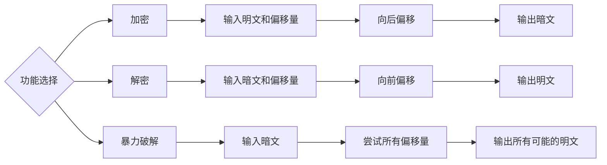

# 凯撒密码实现

网安2401陈浩宇2243111669单人完成

## 一、项目简介

本项目使用 **Python** 实现经典的 **凯撒密码（Caesar Cipher）** 算法。凯撒密码是一种简单的替换加密算法，通过将字母按照固定偏移量进行循环移动，实现文本的加密与解密。
例如，当偏移量为 3 时：

```
HELLO → KHOOR
```

在基础功能之上，本项目还实现了 **暴力破解功能**。当不知道偏移量时，可以选择尝试所有可能的偏移量，并输出所有解密结果，用户可以根据语义判断正确答案。
该项目主要用于帮助理解：
- Python 字符串处理
- ASCII字符编码（ord / chr）
- 函数设计
- 模运算
- 基本加密算法原理

---

## 二、流程图

---
## 三、功能介绍

本项目主要实现三个核心功能：
### 1 加密功能
函数：

```python
caesar_encrypt(text, shift)
```
功能：
对输入文本进行凯撒加密。
实现逻辑：
- 小写字母在 `a-z` 范围内循环移动
- 大写字母在 `A-Z` 范围内循环移动
- 非字母字符保持不变
- 偏移量自动对 26 取模
示例：

```
输入：Hello
shift = 3
输出：Khoor
```

---

### 2 解密功能

函数：
```python
caesar_decrypt(text, shift)
```
功能：
对密文进行解密。
实现方式：
解密实际上是加密的逆操作，因此程序直接调用加密函数，并传入 **负偏移量**。
这样可以避免重复代码，提高代码的复用性。
示例：

```
输入：Khoor
shift = 3
输出：Hello
```

---

### 3 暴力破解

函数：

```python
caesar_brute_force(ciphertext)
```

功能：
当用户不知道偏移量时，程序会自动尝试 **0 到 25 的全部偏移量**，并输出所有可能的解密结果。
用户可以根据语义判断正确结果。
示例：

```
输入：Khoor

输出：

偏移量 0 : Khoor
偏移量 1 : Jgnnq
偏移量 2 : Ifmmp
偏移量 3 : Hello
...
```

---

## 四、核心代码

```python
def caesar_encrypt(text, shift):
    shift = shift % 26
    result = []

    for ch in text:
        if 'a' <= ch <= 'z':
            new_char = chr((ord(ch) - ord('a') + shift) % 26 + ord('a'))
            result.append(new_char)
        elif 'A' <= ch <= 'Z':
            new_char = chr((ord(ch) - ord('A') + shift) % 26 + ord('A'))
            result.append(new_char)
        else:
            result.append(ch)

    return ''.join(result)


def caesar_decrypt(text, shift):
    return caesar_encrypt(text, -shift)


def caesar_brute_force(ciphertext):
    results = {}
    for shift in range(26):
        results[shift] = caesar_decrypt(ciphertext, shift)
    return results

```

## 四、视频演示

通过网盘分享的文件：网安2401陈浩宇.mp4
链接: https://pan.baidu.com/s/1As50YsLjKizrMlc1g8Tfgw?pwd=zoye 提取码: zoye
